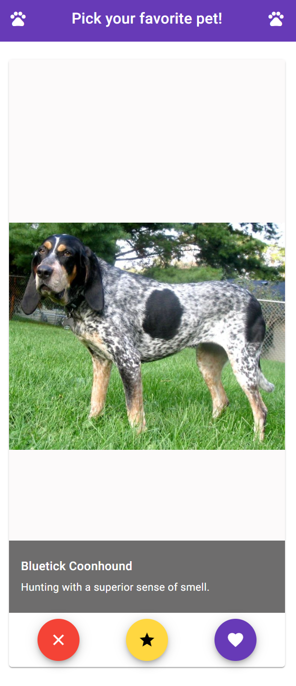
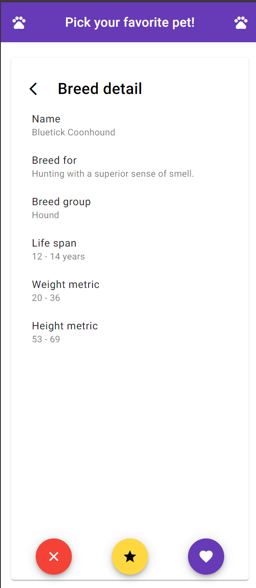

# Application Title

Simple project of Dog Finder

## Description

A project to find pets and vote for them accordingly

## Pages and instruction

### Main page

This page is the core of the application, housing most of the features.

#### As a user, you can reject a breed by

* Swiping left
* Clicking on a ❌ button

#### As a user, you can like a breed by

* Swiping right
* Clicking on a ✅ button

#### As a user, you can super like a breed by

* Swiping up
* Clicking on a ⭐ button

#### As a user, you can access the details page by

* Tapping or clicking anywhere on the image or text

#### As a user, your swiping progress saved if you reload the page, so the application smartly know the last id loaded and continue from the next one

### Details page

#### This page will display comprehensive information about the dog including

* weight.metric
* height.metric
* name
* bred_for
* breed_group
* life_span
* temperament

#### As a user, you can go back by

* Tapping on back arrow button
* Tapping on the details page

## Libraries used

### hammerjs

This library is excellence for detecting touch gestures throughout the system

### lodash

This library provide utility function which reduce the coding time

### Angular Material

This UI library provide a consitent, mature package of components and function for UI and is especially very touch friendly

## Sidenotes

### I decide not to use any store library since we don't really need expensive storing just yet

### Due to an authentication error on the cat API, I am temporary using a mock API to on voting API. This can simply be unlocked by remove the Mock Service in Application Config
